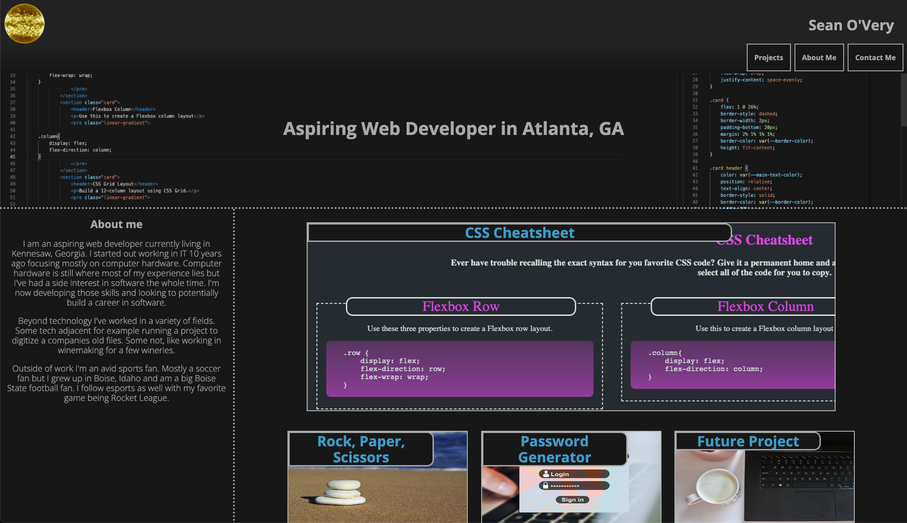
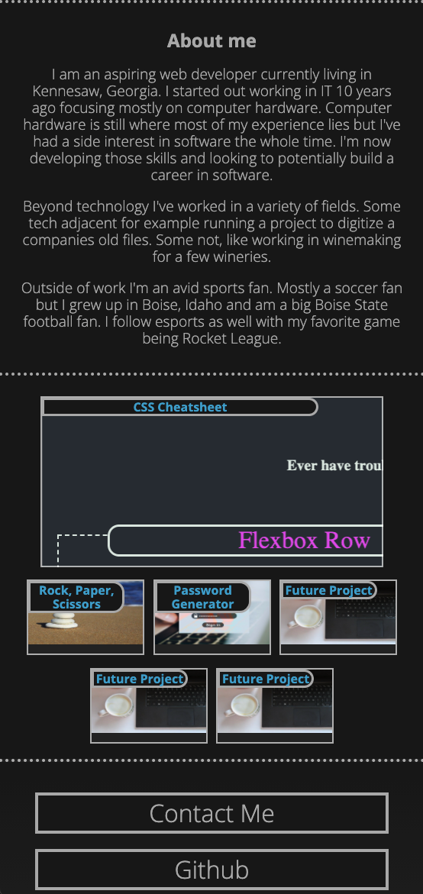

# Sean O'Very CSS Portfolio

## Summary

The goal of this project is to create a portfolio page for myself showing my coding projects. The page uses only HTML and CSS.

---

## Details

* HTML and CSS only.
* Projects displayed and linked to with largest project front and center.
* Responsive CSS design.
* Details about me and how to contact me included.

---

## Live Site

Link to the live site [here.](https://seanovery.github.io/Sean-O-Very-CSS-Portfolio/)

---

## Preview

---

